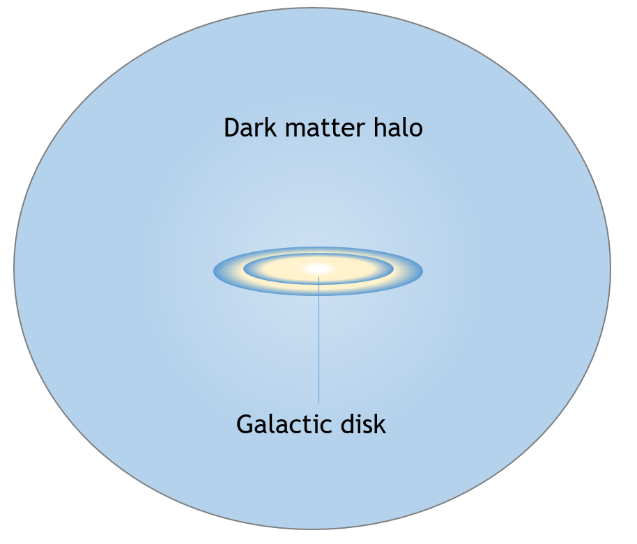
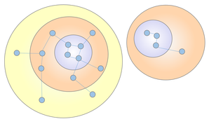
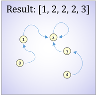
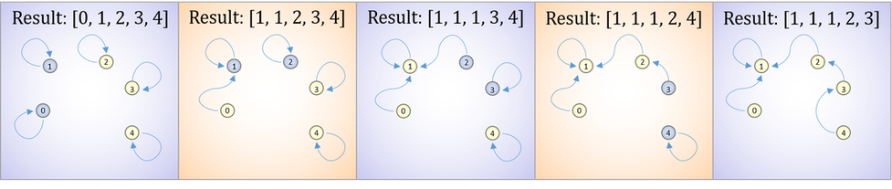
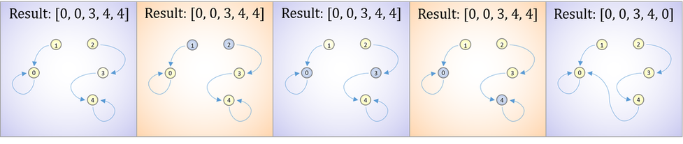
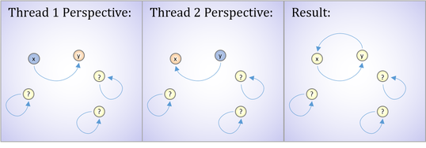
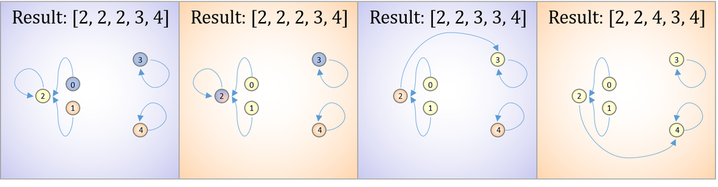
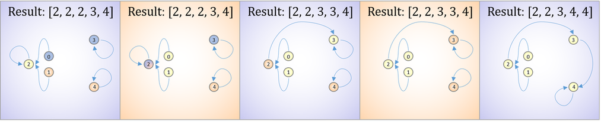
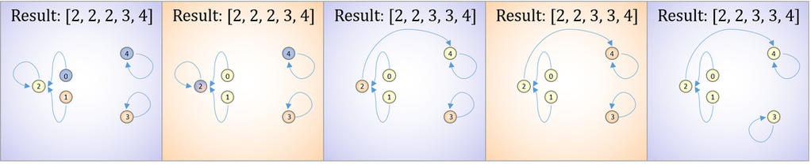

## Introduction

A number of years ago, I created some software for expediting the processing of halo-finding simulations. It formed part of my M.S thesis at the time, so I thought I'd give it a quick write-up for anyone with a passing interest. In addition, it should be in a state that would allow someone to tailor it to their own requirements with minimal effort.

### What is halo-finding?

Cosmological simulations are used by astronomers to investigate large scale structure formation and galaxy evolution. Halo-finding is the discovery of gravitationally-bound objects such as dark matter halos, and it is a crucial step in this process. Okay, but what is a [dark matter halo](https://en.wikipedia.org/wiki/Dark_matter_halo)? Well firstly, dark matter refers to transparent material that is postulated to exist in space, and accounts for the majority of the total mass in the universe. It cannot be observed directly, via telescope or other means, nor does it emit or absorb light or any other electro-magnetic radiation at any significant level. Instead, it's existence is inferred from its gravitational effects on visible matter.

{:height="350px" width="350px" .align-center}
<figcaption style="width:70%;margin:auto;padding-bottom:20px;text-align:center;">A simplistic impression of a dark matter halo encompassing a galaxy.</figcaption>

A dark matter halo, then, is an almost spherical component of a galaxy, and is responsible for holding the galaxy together via gravity. Astronomers believe that this structure is closely related to galaxy evolution, and so it is no surprise that many means for its detection have been developed.

### Halo-finding methods

Perhaps the simplest and easiest to implement halo-finding method - and, totally incidentally, the one we use - is known as the friends-of-friends method. Essentially, the method aims to identify overly-dense objects in observed - or simulated - galaxy distributions. This is done by selecting members, or particles, that lie roughly within a local iso-density contour, which is determined by a free parameter called the linking length. Essentially, the method links together particles that are within a certain distance of one another, according to a threshold called the linking length.

{: .align-center}
<figcaption style="width:70%;margin:auto;padding-bottom:20px;text-align:center;">Two distinct halos with particles linked by the friends-of-friends method. Particles are only linked if the distance between them is less than a predefined linking length.</figcaption>

Any set of particles that are linked together form a distinct halo. The linking itself is only executed if the linking length is less than the distance between two particles. As such, the constraint is the Euclidean distance as follows:

$$l = \sqrt{(x_i - x_j)^{2} + (y_i - y_j)^{2} + (z_i - z_j)^{2}}$$

where $$l$$ is the linking length, and $$x$$, $$y$$ and $$z$$ are position parameters for particles $$i$$ and $$j$$ in 3-dimensional space.

## Algorithm design

It seems obvious that a method such as friends-of-friends is of $$O(n^{2})$$ complexity, since every particle needs to compute its distance from every other particle. But it is also an n-body problem. That is, it is a problem of predicting the individual motions of a group of celestial objects interacting with each other gravitationally. The keyword here is "individual". Every particle in the system is computationally independent of every other particle. These kinds of problems are well suited to multi-threading, but more specifically, they are extremely amenable to the [SIMD](https://en.wikipedia.org/wiki/SIMD) architecture of a [GPU](https://en.wikipedia.org/wiki/General-purpose_computing_on_graphics_processing_units).

So now we can process every particle simultaneously in its own thread on the GPU, but this is still a naive, brute-force approach. Computing the distance between two particles that are obviously too far apart to be linked seems wasteful. We can improve on this by constructing a [kd-tree](https://en.wikipedia.org/wiki/K-d_tree) on the data. A kd-tree is a space-partitioning data structure that is extremely useful for organising points in a k-dimensional space. It allows us to remove large portions of the search space by removing entire tree branches should any particles they contain not intersect the query range - or in our case, the linking length - of a particle. In essence, kd-trees allow us to more efficiently report every particle that is within linking length range of any query particle.

Typically, and as with most tree structures, kd-trees are traversed recursively. In this case, however, perhaps we should revise this pattern. Since the data can include many millions of particles, all of which need to be copied to the GPU in kd-tree form, we will be heavily constrained on memory. A recursive traversal requires additional memory to hold a recursive stack, multiplied by the number of concurrently running threads, since each thread is traversing the tree separately. An iterative approach, however, simply requires the addition of a parent node pointer to each kd-node, and so has a fixed memory footprint that is not dependent on tree depth. Unfortunately, the implementation is also somewhat more complex. The iterative approach is utilised for the purposes of this investigation, but both approaches are implemented in the [full code](https://github.com/danielkylewood/gpu-halo-finder).

At this point, it is clear that we need to construct a kd-tree on the data, copy the kd-tree to the GPU, and conduct a range query for every particle in its own thread. Now, we need to determine how we will represent the linked particles on the GPU. As we will be constrained on memory, however, it is important that the results we generate be as compact as possible.

To do this, we can use an integer array to represent what each particle is linked to. However, this limits each particle such that it can only be linked to one other particle. In order to make this work, we need to create chains of connected particles, where each chain terminates at a distinct particle in every halo. We will refer to this terminating particle as the "sink" particle.

The sink particle is unique within every halo, and will be represented by linking the particle to itself. Consider the example below: for a scenario containing 5 particles, if the $$0th$$ particle is linked to the $$1st$$ particle, the $$0th$$ element of the resultant array will be $$1$$. Furthermore, if the $$2nd$$ particle is the sink for this halo, the $$2nd$$ element in the resultant array will be 2.

{: .align-center}
<figcaption style="width:70%;margin:auto;padding-bottom:20px;text-align:center;">A depiction of chained particles within a halo terminating at a "sink" particle.</figcaption>

We can build on this. Our goal is to chain particles together in such a way that all chains within the same halo terminate at a unique sink particle within that halo. To begin, we can initialise our resultant array such that each particle is linked to itself, making it its own halo and sink. During computation, when a particle is reported to be within the linking length of another particle, the query particle will link to the target particle. Let's examine this in the context of our last example: At first, every particle is linked to itself. When particle $$0$$ is reported to be within linking length range of particle $$1$$,  particle $$0$$ links itself to particle $$1$$, and the rest follows as below:

{: .align-center}
<figcaption style="width:70%;margin:auto;padding-bottom:20px;text-align:center;">A depiction of chained particles within multiple halos terminating at a "sink" particle. When a query particle discovers that it is within linking length of another particle, it links itself to that particle and modifies the resultant integer array accordingly.</figcaption>

Naturally, in a multi-threaded environment, where every particle is computing range queries at the same time, multi-particle halos will be attempting to link to other multi-particle halos. In this case, we need to avoid simply linking a particle to a new halo, as it may already belong to a different one. We can extend the method we have developed to account for this. When a particle discovers another particle within linking length range, both particles search for their respective sinks, and the sinks link to each other instead. Looking back at our example, this time we begin with partly formed halos. When particle $$1$$ discovers it is within range of particle $$2$$, both particles search for their respective sinks, and link accordingly, maintaining each halo structure and a single sink per halo.

{: .align-center}
<figcaption style="width:70%;margin:auto;padding-bottom:20px;text-align:center;">A depiction of two partially formed halos linking. When particle 1 links to particle 2, they search for their respective sinks and link accordingly.</figcaption>

With such an extension, however, threads are no longer operating solely on their own assigned data elements. Instead, we have opened ourselves to the possibility of multiple threads operating on the same data element at the same time. This is bound to result in [race conditions](https://en.wikipedia.org/wiki/Race_condition) if not managed properly. Solutions to this are discussed during implementation.

Now we have a good idea of what to expect when we hit the GPU, but how do we extract useful information from our array? This part isn't too complex, and can be performed efficiently on the CPU. Once we have the result back from the GPU, we can begin. The algorithm is as follows:

1. Iterate through every element in the array
2. If the current element has not been processed, follow the chain it represents back its sink particle, counting the number of particles as we go, and marking each element we hit as processed.
3. When we hit the sink, add it to a dictionary, and add the number of particles it took to get to the sink to its value

And that's it! We can now report exactly how many halos there are, and how many particles are in each halo. There is more we could do here with some effort, such as create a colour-coded visualisation of the space and its halos, but we will leave this as future work.

### Implementation

This section requires some knowledge of C and the CUDA API. That said, I've tried to write it so that one can follow regardless.

### The data

Astronomers typically use a tipsy binary format for efficient file-based particle storage. Files contain a header describing the number of particles as well as some other fields that are not important in this context. The header is followed by the position and velocity data for every particle, both of which are in 3 dimensions. Since we only require the positional data for distance computations, the velocity data is not used. The file is read in particle sized chunks and the positional data is inserted directly into an array of kd-tree nodes.

~~~
// Read file data
int ReadFileData(char* fileName, kdNode** dataArray)
{
   // Structs for chunking
   struct ParticleCountData dataDump;
   struct ParticleData particle;

   FILE *file = fopen(fileName, "rb");
   if (file == NULL) {
      printf("File not found!");
      exit(1);
   }

   // Header chunk
   fread(&dataDump, sizeof(ParticleCountData), 1, file);

   // File header data
   int nParticles = dataDump.nbodies;
   int nDark = dataDump.ndark;
   int nGas = dataDump.nsph;
   int nStar = dataDump.nstar;
   int nActive = 0;
   if (nDark) nActive += nDark;
   if (nGas) nActive += nGas;
   if (nStar) nActive += nStar;

   // Allocate memory for kd-node array
   *dataArray = new kdNode[nParticles];

   // Read each data chunk and add to kd-node array        
   for (unsigned int i = 0; i < nParticles; i++) {
      fread(&particle, sizeof(ParticleData), 1, file);
      if (nDark) {
         (*dataArray)[i].coords[0] = particle.pos[0];
         (*dataArray)[i].coords[1] = particle.pos[1];
         (*dataArray)[i].coords[2] = particle.pos[2];
      }
   }
   fclose(file);
   return nParticles;
}
~~~
{: .language-c}

### The kd-tree

Once the data has been inserted into the array, we can construct the kd-tree on top. But first, let's consider the kd-node structure. We require the following:

1. A float array for the position coordinates
2. Integers denoting where the left and right children are in the array
3. An integer indicating the axis that the node was split on (x, y, z)
4. An integer denoting the parent of the node

Positional coordinates together with child pointers are obvious - our nodes are useless without their corresponding tree and particle data. The split axis (or dimension) is required because we need to know which coordinate value each node was split on during construction in order to decide whether to omit a branch from the tree traversal. The exact constraints deciding this are discussed later. Strictly speaking, the split dimension is not entirely necessary as it can be computed on the fly using the number of dimensions and the depth of the node in the tree. Storing it during construction, however, is vastly more efficient than computing it for every node in every thread during traversal. Finally, a pointer to the parent node is necessary to perform an iterative tree traversal.

Kd-tree construction can seem complex at first, but it is actually fairly easy once you get a handle on it. For a set of particles in k-dimensional space, a kd-tree is constructed in the following manner:

1. Select the split dimension for the current level (x for the root node)
2. For each node at this level of the tree, sort the list of points on the split dimension
3. Select the median of the points with respect to the split dimension
4. Send the list of points to the left of the median down the left sub-tree, and the list of points on the right down the right sub-tree
5. Go back to step 2 and repeat until all points have been assigned to a node

A split dimension, essentially, is a splitting [hyperplane](https://en.wikipedia.org/wiki/Hyperplane) for each node which divides the space into two parts. In a 2-dimensional tree, the split dimension for the root node is the x axis, the split dimension for its children is the y axis, and the split dimension for their children cycles back to the x axis, and so on.

As we already have an array of kd-nodes populated with positional coordinates, all we need to do is fill in the missing fields. In other words, we will construct the kd-tree on top of the existing array. In order to do this efficiently, we can improve the sorting in our construction algorithm.

It is clear that we do not need to compute a complete sort for the sub-list of points at each node. Instead, we only require the median in the list, and a guarantee that all nodes to the left of the median are smaller, and all nodes to the right of the median are larger. This is actually a well-known selection algorithm called [quickselect](https://en.wikipedia.org/wiki/Quickselect). This allows us to reduce the complexity of performing an $$O(n\log{n})$$ sort at every node to performing an $$O(n)$$ select instead.

With all this in mind, we can write our code as below. The original kd-tree construction code can be found [here](http://rosettacode.org/wiki/K-d_tree#C). It has been modified to construct the tree on a pre-existing array, compute parent pointers, and return the integer index for the root node in the array.

~~~
// Swaps two kd-nodes
void SwapNodes(struct kdNode *x, struct kdNode *y) {
   float coords[3];
   memcpy(coords, x->coords, sizeof(coords));
   memcpy(x->coords, y->coords, sizeof(coords));
   memcpy(y->coords, coords, sizeof(coords));
}

// Finds the median for the specified range of kd-nodes with quick select
kdNode* FindMedian(struct kdNode *start, struct kdNode *end, int idx)
{
   if (end <= start) return NULL;
   if (end == start + 1)
      return start;

   struct kdNode *p, *store, *mid = start + (end - start) / 2;
   float pivot;

   while (1) {
      pivot = mid->coords[idx];
      SwapNodes(mid, end - 1);
      for (store = p = start; p < end; p++) {
         if (p->coords[idx] < pivot) {
            if (p != store)
               SwapNodes(p, store);
            store++;
         }
      }
      SwapNodes(store, end - 1);

      if (store->coords[idx] == mid->coords[idx])
         return mid;

      if (store > mid)
         end = store;
      else
         start = store;
   }
}

//Constructs the kd-tree recursively overlayed on the data array and returns the array index of the root node
int ConstructTree(kdNode *arrayBeginning, kdNode* startPointer, int length, int curDimension, int dim, int parent)
{       
   kdNode *midPointer;      
   int index;

   midPointer = FindMedian(startPointer, startPointer + length, curDimension);
   if (midPointer) {
      index = midPointer - arrayBeginning;
      midPointer->splitDim = curDimension;
      curDimension = (curDimension + 1) % dim;
      midPointer->parent = parent;
      midPointer->left = ConstructTree(arrayBeginning, startPointer, midPointer - startPointer, curDimension, dim, index);
      midPointer->right = ConstructTree(arrayBeginning, midPointer + 1, startPointer + length - (midPointer + 1), curDimension, dim, index);
      return index;
   }
   return -1;
}
~~~
{: .language-c}

### Moving the data to the GPU

With the kd-tree constructed, we can now move our data over to the device (GPU). This is relatively simple and similar to memory copying and allocation on the host (CPU). The CUDA API provides functionality to do this as shown below.

~~~
// Copies data to device and initialises memory
void CopyDataToDevice(kdNode *dataArray, int *resultArray, int nParticles)
{
   // Initialise memory for data and result arrays
   CUDA_CHECK_RETURN(cudaMalloc((void**)&d_resultArray, sizeof(int) * nParticles));
   CUDA_CHECK_RETURN(cudaMalloc((void**)&d_dataArray, sizeof(kdNode) * nParticles));

   float memoryAllocated = ((float)sizeof(d_dataArray[0]) + (float)sizeof(d_resultArray[0])) / 1000000 * nParticles;
   printf("Allocated %fMB of device memory...\n", memoryAllocated);

   //Copy data and result arrays to device
   CUDA_CHECK_RETURN(cudaMemcpy(d_resultArray, resultArray, sizeof(int) * nParticles, cudaMemcpyHostToDevice));
   CUDA_CHECK_RETURN(cudaMemcpy(d_dataArray, dataArray, sizeof(kdNode) * nParticles, cudaMemcpyHostToDevice));

   printf("Copied all data to device...\n");
}
~~~
{: .language-c}

For those not familiar with C and CUDA functionality, cudaMalloc allocates memory for the data on the device, and cudaMemcpy copies the host side data to the allocated memory.

### Traversing the kd-tree

Once the data has been copied to the device, we can kick off the range queries and begin computation. Firstly, we need to assign a thread to each query particle. These are the particles for which we will report nodes within linking length range. That is, all of them. Since the nodes in the kd-tree array contain a reference to the data for each particle, we simply need to map the threads to each array index.

~~~
// Initalises threads and assigns indexes
__global__ void BeginRangeQuery(const kdNode *dataArray, int *resultArray, const float linkingLength, const int nParticles, const int kdRoot)
{
   // Set up the thread indexes
   int idx = blockIdx.x * blockDim.x + threadIdx.x;
   if (idx >= nParticles)
      return;

   // Select tree traversal method
   SearchKdTreeIteratively(dataArray, dataArray[idx], resultArray, linkingLength, kdRoot, idx);
}
~~~
{: .language-c}

In the first line of the function, we flatten the typical grid-like thread indexing to map directly over our kd-tree array, and in the next line, we discard any threads that are not referencing an array element. With each thread assigned to a distinct query particle, we can traverse the kd-tree and compute our resultant array of particle links.

As discussed previously, we utilise an iterative approach to kd-tree traversal in order to minimise our memory usage. To do so, it is important to note that the main difference between this approach and a recursive traversal is the lack of an implicit stack. As such, we now require the following additional information:

1. An indicator for which direction we are traveling in the tree
2. A store for the previous node processed

The direction that we are traveling in the tree is important because we no longer know when exactly we should consider the second sub-tree of any particular node. On a similar note, we require a store for the previous node so that we are always aware of which sub-tree we have come from when traveling back towards the root on our way up.

If we are moving down in the tree:

1. Evaluate whether we should traverse down the left and right sub-trees
2. If we should go left, store the current node in the previous node variable, and make the current node the left child
3. Else if we should go right, store the current node in the previous node variable, and make the current node the right child
4. Else there is no where downwards to go and we move back up - store the current node in the previous node variable, make the current node the parent of the current node, and specify that we are now moving up the tree

Otherwise if we are moving up the tree:

1. Evaluate whether we should traverse down the right sub-tree
2. If we came to this node from the left sub-tree and we should traverse right, store the current node in the previous node variable, make the current node the right child, and specify that we are traveling down the tree
3. If we came to this node from the left sub-tree and we should not traverse right, make it look as though we are coming up from the right sub-tree by storing the right child in the previous node variable
4. If we came to this node from the right sub-tree (or it looks like we did from step 2.3), continue moving up the tree by storing the current node in the previous node variable, and make the current node the parent of the current node

During traversal, before we decide on which node to evaluate next, we compute the distance between the threads query particle and the current node in the tree. If this distance is less than the linking length, we call a function to modify our resultant array.

In addition, when evaluating whether we should traverse down a certain sub-tree, we are essentially checking whether any particle down that sub-tree intersects the space within linking length range of the threads query particle. This decision is based on the following constraints:

$$currentNode.coordinates[split_{axis}] > queryNode.coordinates[split_{axis}] + linkingLength$$
$$currentNode.coordinates[split_{axis}] < queryNode.coordinates[split_{axis}] - linkingLength$$

For the left and right sub-trees respectively. The code follows:

~~~
// Iteratively searches the kd-tree - this method is prefered as it uses no extra memory at only a small hit in run-time
__device__ void SearchKdTreeIteratively(const kdNode *dataArray, const kdNode &queryPoint, int *resultArray, float linkingLength, int kdRoot, int queryIndex)
{
   int previousNode = kdRoot;
   int currentNode = kdRoot;
   bool goingDown = true;
   int splitAxis = dataArray[currentNode].splitDim;
   float coordinateValueCurrentNode = dataArray[currentNode].coords[splitAxis];
   float coordinateValueQueryNode = queryPoint.coords[splitAxis];

   // Find the distance between these two particles and attempt to link them if they are within linking length distance
   float calculatedDistance = Distance(queryPoint, dataArray[currentNode]);
   if (calculatedDistance <= linkingLength && calculatedDistance != 0)
      EvaluateParticlePairsWithinLinkingLength(resultArray, queryIndex, currentNode);

   // Check if there are possible particles within linking length distance down the left or right of the tree
   bool possibleNodeLeft = coordinateValueCurrentNode > (coordinateValueQueryNode - linkingLength);
   bool possibleNodeRight = coordinateValueCurrentNode < (coordinateValueQueryNode + linkingLength);

   if (!possibleNodeLeft && !possibleNodeRight)
      return;
   if (possibleNodeLeft)
      currentNode = dataArray[currentNode].left;
   else
      currentNode = dataArray[currentNode].right;

   // Check that we have not finished traversing the entire tree already
   while (!(currentNode == kdRoot && previousNode == dataArray[currentNode].right))
   {
      splitAxis = dataArray[currentNode].splitDim;
      coordinateValueCurrentNode = dataArray[currentNode].coords[splitAxis];
      coordinateValueQueryNode = queryPoint.coords[splitAxis];
      int currentLeft = dataArray[currentNode].left;
      int currentRight = dataArray[currentNode].right;

      // If we are currently traversing down the tree
      if (goingDown)
      {
         // Find the distance between these two particles and attempt to link them if they are within linking length distance
         calculatedDistance = Distance(queryPoint, dataArray[currentNode]);
         if (calculatedDistance <= linkingLength && calculatedDistance != 0)
            EvaluateParticlePairsWithinLinkingLength(resultArray, queryIndex, currentNode);

         // Check if there are possible particles within linking length distance down the left or right of the tree
         possibleNodeLeft = coordinateValueCurrentNode > (coordinateValueQueryNode - linkingLength);
         possibleNodeRight = coordinateValueCurrentNode < (coordinateValueQueryNode + linkingLength);

         // If there is a possible node to the left and the node is not empty
         if (possibleNodeLeft && currentLeft != -1)
         {
            // Go down this branch
            previousNode = currentNode;
            currentNode = currentLeft;
         }
         // If there is a possible node to the right and the node is not empty
         else if (possibleNodeRight && currentRight != -1)
         {
            // Go down this branch
            previousNode = currentNode;
            currentNode = currentRight;
         }
         else
         {
            // We are at a leaf node or there are no further particles of interest and should head back up the tree
            previousNode = currentNode;
            currentNode = dataArray[previousNode].parent;
            goingDown = false;
         }
      }
      // If we are currently traversing up the tree
      else
      {
         // Check if there are possible particles within linking length distance down the right of the tree
         possibleNodeRight = coordinateValueCurrentNode < (coordinateValueQueryNode + linkingLength);

         // If we came to this node from a left child node
         if (previousNode == currentLeft)
         {
            // If there is a possible node to the right and it is not empty
            if (possibleNodeRight && currentRight != -1)
            {
               // Go down this branch
               previousNode = currentNode;
               currentNode = currentRight;
               goingDown = true;
            }
            else
               // Pretend we are coming back up from this branch
               previousNode = currentRight;                         
         }
         // If we came to this node from a right child node
         else if (previousNode == currentRight)
         {
            // We are finished here and should head back to parent
            previousNode = currentNode;
            currentNode = dataArray[previousNode].parent;
         }
      }
   }
}
~~~
{: .language-c}

The complexity, as discussed, is due to replicating the inherent first-in, last-out nature of a stack.

Also of note is that for each iteration of the while loop, any property of the current and previous nodes that is used more than once and will not change is purposely stored in registers. This limits the number of accesses we need to make to the global memory on the device, which has comparatively higher latency.

During traversal, when a particle is discovered to be within linking length range of the threads query particle, we call our linking function. As previously discussed in the design, our algorithm looks as follows:

1. Find the sink for both the query and target particle halos
2. If the sinks are not the same, link the sinks together

While the algorithm seems easy enough, the actual implementation is not so simple. Specifically, the fact that we are working in a multi-threading environment, together with the fact that threads are no longer limited to editing only the particle data that they are responsible for, exposes us to the possibility of race conditions and other problems.

Our first issue pertains to double linking. In our algorithm design, we asserted that a query particle should always link to the target particle. While this works perfectly well when the linking occurs sequentially, problems present themselves linking can occur simultaneously.

Consider an example: for one thread, the query is $$x$$ and the target, $$y$$, and for a second thread the query is $$y$$ and the target, $$x$$. Should these threads compute this at the same time, they both link to each other, removing the sink particle for each halo and creating a circular chain.

{: .align-center}
<figcaption style="width:70%;margin:auto;padding-bottom:20px;text-align:center;">The double linking problem. Thread 1 considers particle x to be its query, and particle y to be its target. Thread 2 considers the opposite. Since the query always links to the target, a circular chain is created.</figcaption>

Fortunately, this problem can be solved fairly easily by removing one direction of the linking. We can do this by ensuring that linking only happens when the query particle has a lower array index than the target particle. Now, when particle $$x$$ in thread $$1$$ links to target $$y$$ in thread $$1$$, it will only link if $$x$$ has a lower array index than $$y$$. If this is the case, then it will never be the case in thread $$2$$, and vice versa.

Our second problem pertains to the loss of links when threads override data recently modified by a second thread. Consider the following scenario: We have three distinct halos. Two particles from halo $$1$$ are trying to link to two different particles from halos $$2$$ and $$3$$, at the same time. As in step 2 from our linking algorithm, all particles seek out their halo sinks. Since a sink is distinct in every halo, the particles from halo 1 find the same sink. At this point, the first particle from halo $$1$$ changes the sink to link to halo $$2$$. Following this, the second particle from halo $$1$$ changes the sink to link to halo $$3$$. And just like that, we have lost a link to halo $$2$$. This is depicted below:

{: .align-center}
<figcaption style="width:70%;margin:auto;padding-bottom:20px;text-align:center;">A race condition causing threads to override data recently modified by another thread.</figcaption>

There are two possible ways to resolve this issue. We can go back and redesign the algorithm in such a way that we no longer have threads operating on the same data. Alternatively, we can use some kind of locking mechanism so that when a thread is operating on some data, no other threads can access the data.

In general, the first approach is considered best, as locking data so that only a single thread can access it discards any advantages that are gained from processing particles in parallel in the first place. That said, there is a third option that combines these approaches. If we can find a way to inform the second particle from halo 1 that the sink has changed, we can instruct it to find the new sink, and there would no longer be a problem. In order to do that, we need to guarantee that the link modification will take place in a single cycle, so that the second particle will never stumble upon a link in progress. This way, the second particle can easily reassess that it has the correct sink. Immediately, we consider the use of [atomic operations](https://en.wikipedia.org/wiki/Linearizability).

Fortunately, the CUDA API provides us with the exact atomic operation that will solve our problem - atomic compare and swap. The function accepts an address, an integer old, and an integer value. It reads the 32-bit or 64-bit word located at the address provided, and computes the following:

$$ (old == compare ? value : old) $$

Where $$old$$ is the value current residing in the provided address. In other words, the function compares the current value residing in the address with compare. If they are the same, it updates the address value to $$value$$. Otherwise, it does nothing. In both cases, the function returns $$old$$.

In the context of our problem, we can leverage this by providing the compare parameter with what the particle expects its sink to be, and the value parameter with what we want to link the sink to. The function then ensures that our proposed sink particle is still the sink particle for its halo, and if it is, the function simply updates the sink to the new link particle. If it is not, however, we know that the sink has been recently updated, and that the new sink is the value of old, which is returned by the function.

{: .align-center}
<figcaption style="width:70%;margin:auto;padding-bottom:20px;text-align:center;">A solution to the race condition problem overriding recently modified data.</figcaption>

While this solves the problem for overriding recently modified links, it forces us to reconsider our solution to the double linking problem discussed first. Let's examine the same example from the previous problem: the two particles from halo $$1$$ have found their sink, and the first particle has edited it. The second particle discovers the modification, and updates its sink. The new sink, however, has a higher index in the array than the target particle, and so linking never occurs. One might think this is working as intended, since now, when the inevitable second thread looks at the linking from the other direction, it will link the particles instead. But what if the other thread has already considered linking to the old sink, and discarded it because it was lower in the index order? We can depict this problem using the picture above, but changing particle $$3$$ to particle $$4$$, and vice versa:

{: .align-center}
<figcaption style="width:70%;margin:auto;padding-bottom:20px;text-align:center;">The double linking solution that we implemented earlier no longer works. When the second thread finds the new sink at particle 4 and tries to link it to particle 3, it finds that particle 3 is the lower index, and discards the link.</figcaption>

There is only one way to solve this. We need to create solutions for both the lower and higher array index conditions. Fortunately, this is easier than it seems. When the query particle index is lower than the target particle index, we can link the target sink to the query sink. When the query particle index is higher than the target particle index, we can link the query sink to the target sink. This solves the problem by ensuring that a link is formed regardless of the query particle index compared to the target, while ensuring that the link only ever goes one direction.

The code for this function follows:

~~~
// Links together particles that are found within linking length range of one another
__device__ void EvaluateParticlePairsWithinLinkingLength(int *resultArray, int queryIndex, int target)
{
   int targetCurrent, targetSink, selfCurrent, selfSink;
   targetCurrent = target;
   targetSink = resultArray[target];
   selfCurrent = queryIndex;
   selfSink = resultArray[queryIndex];

   // Need to find the current sink particle for the self halo or the target halo
   while (selfCurrent != selfSink || targetCurrent != targetSink)
   {
      targetCurrent = targetSink;
      targetSink = resultArray[targetCurrent];
      selfCurrent = selfSink;
      selfSink = resultArray[selfCurrent];
   }

   // If they are not currently part of the same halo, connect them using some simple conditional statements to avoid race conditions      
   bool updateSinkParticle = false;
   while ((selfSink != targetSink) && (updateSinkParticle == false))
   {
      int valueChange;
      if (selfSink < targetSink)
      {
         valueChange = atomicCAS(&resultArray[targetSink], targetSink, selfSink);
         if (valueChange == selfSink)
            updateSinkParticle = true;
         else
            targetSink = valueChange;
      }
      else if (selfSink > targetSink)
      {
         valueChange = atomicCAS(&resultArray[selfSink], selfSink, targetSink);
         if (valueChange == selfSink)
            updateSinkParticle = true;                  
         else                    
            selfSink = valueChange;
      }         
   }
}
~~~
{: .language-c}

Finally, we have a working, race condition free algorithm. In addition to everything discussed above, slight modifications were made to finding the sinks. The fact is, we only need one, whether it belongs to the query particle or the target. Having only one sink, and continuing to link as above, still creates a valid particle chain that we can iterate over later. As a bonus, we shave off a few computation cycles, and distribute the particles used for linking more uniformly, thereby reducing the probability of multiple threads hitting the same sink particles at the same time.

Before we begin post-processing, we need to grab the resultant data back from the GPU:

~~~
// Fetches the result array from device and copies it back to host
void FetchDeviceResultArray(int *resultArray, int nParticles)
{
   CUDA_CHECK_RETURN(cudaMemcpy(resultArray, d_resultArray, sizeof(int) * nParticles, cudaMemcpyDeviceToHost));
}
~~~
{: .language-c}

Now that we have our results, we can process them as described in our algorithm design. The code follows:

~~~
// Computes results returned from device by counting the number of particles belonging
// to seperate halos, and which of these halos exceed the minimum particles per halo count
void ComputeResults(int* haloMemberCounterArray, int* particlesProcessedArray, int* resultArray, int minimumHaloGroupCount, int nParticles)
{
   // Iterate through result array and find particles on particles that have not been processed
   for (int currentParticle = 0; currentParticle < nParticles; currentParticle++)
   {
      if (particlesProcessedArray[currentParticle] == 0)
         FindParticles(haloMemberCounterArray, particlesProcessedArray, resultArray, currentParticle, 0);
   }

   // Get the number of particles in each halo
   int possibleHalo = 0, definiteHalo = 0;
   for (int i = 0; i < nParticles; i++)
   {
      if (haloMemberCounterArray[i] > 0)
         possibleHalo++;
      if (haloMemberCounterArray[i] >= minimumHaloGroupCount)
         definiteHalo++;            
   }
   printf("%d initial groups, %d actual halos\n", possibleHalo, definiteHalo);
}

// Determines how many particles belong to a particle at the end of the chain
void FindParticles(int* haloMemberCounterArray, int* particlesProcessedArray, int* resultArray, int currentParticle, int particleCounter)
{
   // Check that the current particle has not been processed
   if (particlesProcessedArray[currentParticle] == 0)
   {
      particleCounter++;
      particlesProcessedArray[currentParticle] = 1;
   }

   // If the current particle is the end of the chain, record the number of particles in the chain
   if (resultArray[currentParticle] == currentParticle)
      haloMemberCounterArray[currentParticle] = haloMemberCounterArray[currentParticle] + particleCounter;
   else
      // Continue down the chain
      FindParticles(haloMemberCounterArray, particlesProcessedArray, resultArray, resultArray[currentParticle], particleCounter);
}
~~~
{: .language-c}

The code above follows the algorithm discussed in our design section, and uses recursion to follow each chain to its sink while counting particles along the way. An array was also used in place of a dictionary. It uses additional space, but is slightly faster. Finally, you might notice that we only report actual halos that have a minimum number of particles. This is to filter out single particles that were not linked, or very sparse halos.

## Future work

There are a number of improvements we could make to this code:

1. Due to the memory limitations of a single GPU, we could probably extend the code to run over multiple GPUs at the same time, increasing parallelism and memory capacity.
2. We could move the kd-tree construction over to the GPU as well. [This paper](http://kunzhou.net/2008/kdtree.pdf) written by Zhou, K. et al might come in handy.
3. There are also many ways to improve performance on a GPU. These include the use of shared memory, streamlined memory accesses and greater instruction- and data-level parallelism.
4. As mentioned earlier, we could present our results visually. This wouldn't take much work, but we will leave it for a future post.

Finally, we implemented a very simple halo-finder. The friends-of-friends algorithm itself suffers from a number of small set-backs that can affect the quality of its results. One of these set-backs is the formation of bridges. This occurs when the most distant boundary particles of two halos link together, forming one halo. While technically correct according to the algorithm, the two halos are not necessarily, and realistically, one and the same. That said, while friends-of-friends at its core is fairly basic, additions to the algorithm exist in order to overcome some issues.

Remember those velocity parameters that I glossed over back when we were discussing the data? Halos are bound together gravitationally, and as such, incorporating particle velocity into our linking parameters might indeed skew the resulting linking constraint to overcome bridging. It would also make this a 6 dimensional problem. But then again, we could probably reduce those dimensions back to 3 by deriving a new "distance" equation.

Spoiler alert: We definitely can. If you're still interested, you are welcome to read the [thesis](pubs.cs.uct.ac.za/archive/00000937/01/danielwoodUpdatedThesis.pdf) I wrote on the subject. Don't take the resultant testing to heart, it was written many years ago, and the code in this write-up has been much improved.

The full code can be picked up from my [GitHub repository](https://github.com/danielkylewood/gpu-halo-finder). It also includes a small data file of 116761 particles. In the real world, this really is nothing. But it could at least get you started.

